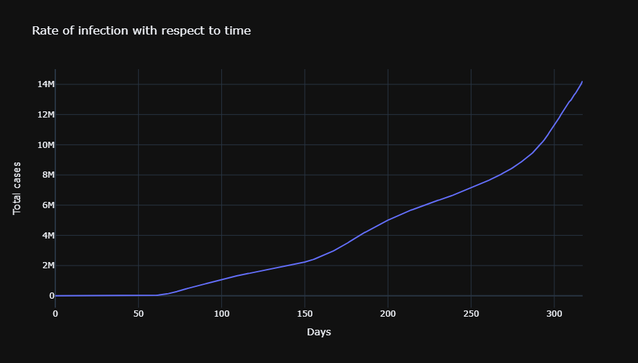

# Covid-19USA
My first data science project, involving covid 19 dataset provided on kaggle, dataset may be outdated as of now. To best view the results, please run the code on kaggle not on jupyter notebook. Dataset used can be found [here](https://www.kaggle.com/sudalairajkumar/novel-corona-virus-2019-dataset).

# Results

## Findings Overall

.png)

## Findings By State
.png)
.png)
